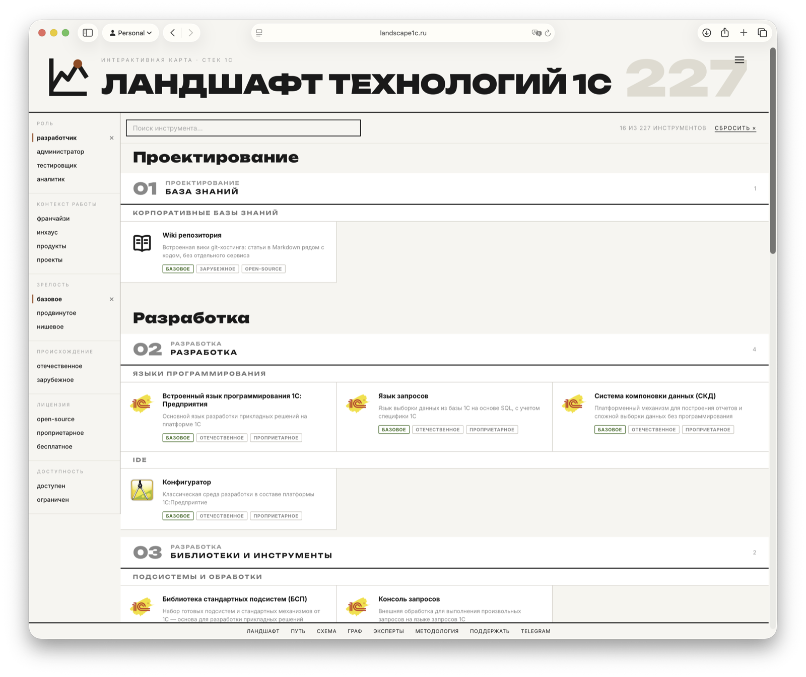
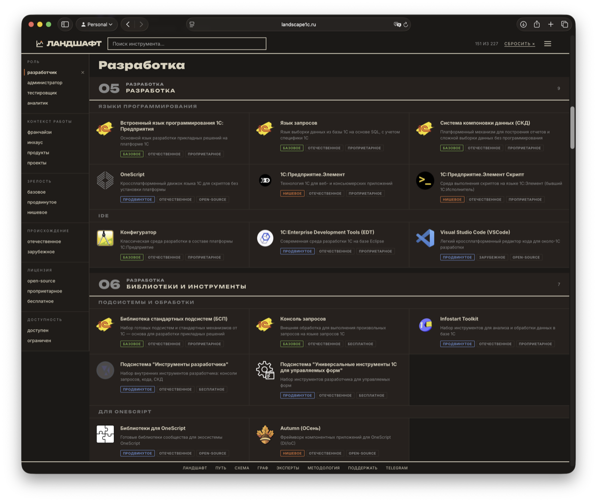
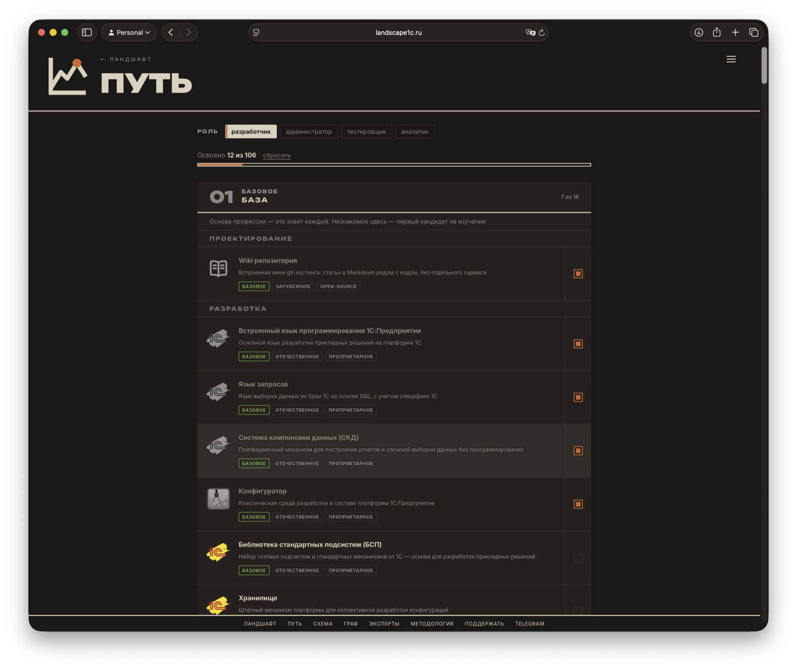
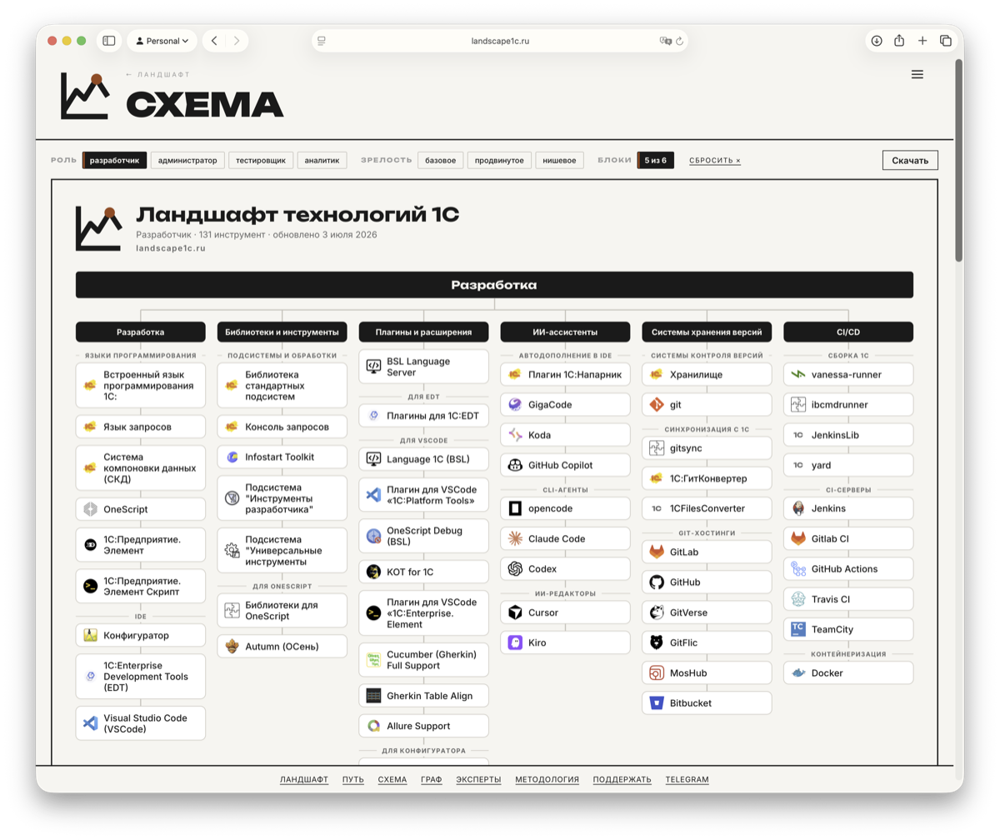
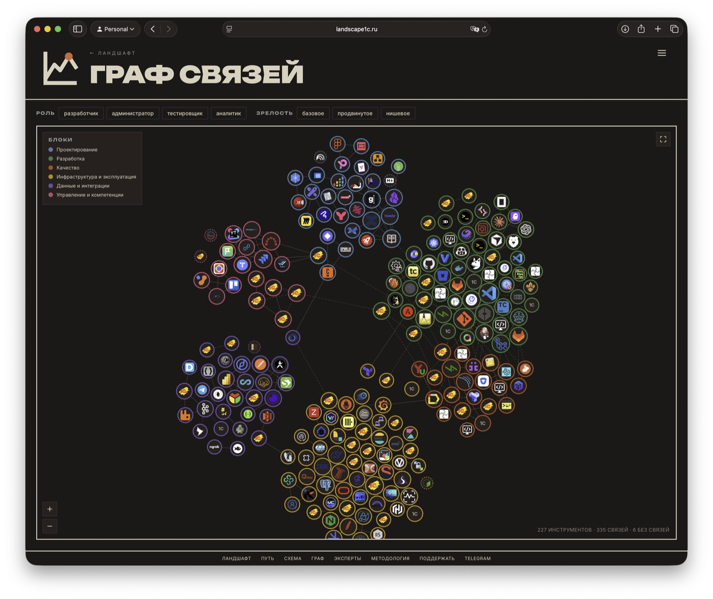

# Ландшафт технологий 1С

[](https://landscape1c.ru)
[](https://github.com/Oxotka/Landscape1C/actions/workflows/deploy.yml)
[](https://github.com/Oxotka/Landscape1C/actions/workflows/validate.yml)
[](LICENSE)

Интерактивная карта экосистемы технологий для разработчика на 1С и около 1С.

Это не просто список инструментов, а **навигация по двум независимым осям** — функциональной роли и контексту работы, — с фильтрами, карточками технологий, связями между ними, графом и маршрутами освоения.

**https://landscape1c.ru**

<p>
  
  
</p>

Сейчас на карте **200+ инструментов** в 24 категориях и 6 блоках. Разметку выверяет [экспертный совет](https://landscape1c.ru/council.html) — кураторы по областям из сообщества 1С.

## Что внутри

- **Две оси навигации:** роль (разработчик / администратор / аналитик / тестировщик) и контекст работы (франчайзи / инхаус / продукты / проекты).
- **Фильтры:** зрелость (базовое / продвинутое / нишевое), лицензия, происхождение (важно для импортозамещения) и доступность на рынке РФ.
- **Карточки** инструментов с описанием, ответом «зачем», ссылками «с чего начать», аналогами и зависимостями. У каждой карточки есть прямая ссылка (`?tool=имя`) — можно делиться.
- **Путь** — маршрут освоения инструментов для выбранной роли: от базы к специализации, с отметками «знаю» и прогрессом; аналоги объединены в группы «на выбор».
- **Граф связей** — отдельная страница по связям `Аналоги`/`Зависимости`.
- **Схема** — постер-древо «блок → категория → инструменты» в одном SVG, с экспортом (SVG / PNG / PDF / майндмап).
- **Методология** разметки и **экспертный совет** кураторов, проверяющих оценки.

Сайт статический, без сборки и зависимостей. Темная и светлая темы, мобильная версия.

## Страницы

### Путь

Маршрут освоения инструментов для выбранной роли: ступени от базы к специализации, отметки «знаю» и прогресс (хранится локально в браузере). Помогает ответить на вопрос «что учить дальше».



### Схема

Постер-древо «блок → категория → инструменты» целиком в одном SVG: отбор по роли и зрелости, скрытие блоков, экспорт в SVG / PNG / PDF / майндмап — можно распечатать или открыть в редакторе.



### Граф связей

Все инструменты и их связи «Аналоги»/«Зависимости» на одной интерактивной карте: кластеры по блокам, клик по узлу открывает карточку.



## Как предложить инструмент или поправить карточку

Самый простой путь — формы: [предложить инструмент](../../issues/new?template=add-tool.yml) или [исправить карточку](../../issues/new?template=fix-card.yml). На карточках сайта есть ссылка «Заметили неточность?» — она открывает форму с уже подставленным названием.

Критерии включения, процесс и правила для Pull Request — в [CONTRIBUTING.md](CONTRIBUTING.md).

## Планы

Подробный замысел и принятые решения — в [docs/TZ.md](docs/TZ.md). Крупное из запланированного:

- **Опрос популярности** — ежегодный срез «кто чем реально пользуется» (в духе State of JS), как второй сигнал ценности рядом с экспертным мнением.

## Как посмотреть локально

Все одним действием — `./start.command` (на macOS можно двойным кликом): поднимет локальный сервер и откроет редактор; сайт — на `http://127.0.0.1:8123/`.

Либо вручную — сборка не нужна, это статика. Запусти любой статический сервер из папки `app/`:

```bash
cd app && python3 -m http.server 8123
# http://127.0.0.1:8123/
```

## Структура

- `app/` — сайт (HTML/CSS/JS без сборки и зависимостей):
  - `index.html` + `app.js` — главная: фильтры, доска карточек, поиск, сортировка
  - `data.js` — единственный источник данных (`window.LANDSCAPE`: `categories`, `blocks`, `axes`, `items`)
  - `detail.js` — общая детальная карточка (модалка) и дип-линки `?tool=…`
  - `path.html` + `path.js` — «Путь»: маршрут освоения по роли с отметками «знаю»
  - `graph.html` + `graph.js` — граф связей; `scheme.html` + `scheme.js` — схема-постер
  - `council.html`, `methodology.html` — экспертный совет и методология (фото в `people/`)
  - `nav.js` — общая навигация (знак, бургер-меню, выбор темы, подвал); `onboarding.js` — подсказки при первом визите; `404.html` — страница «не нашлась»
  - `editor.html` + `editor.js` — визуальный редактор разметки (на сайт не публикуется)
  - `styles.css`, `logos/` — оформление и логотипы
- `scripts/` — `validate.js` (проверка целостности данных), `cachebust.js` (версии `?v=` ассетов по хешу содержимого), `sitegen.js` (sitemap.xml и llms.txt из данных), `linkcheck.js` (проверка внешних ссылок карточек на живость), `build.js` (сборка `dist/`), `serve.py` (пишущий сервер для редактора)
- `docs/` — [TZ.md](docs/TZ.md) (замысел, принятые решения, планы) и [METHODOLOGY.md](docs/METHODOLOGY.md) (правила разметки осей)

## Данные и разметка

Весь контент — в `app/data.js`.
Править можно вручную или через визуальный редактор `app/editor.html`, который пишет правки прямо в файл (для записи нужен пишущий сервер — обычный `http.server` так не умеет; проще всего `./start.command`):

```bash
python3 scripts/serve.py     # http://127.0.0.1:8123/editor.html
node scripts/validate.js     # проверка целостности: оси, блоки, логотипы, связи
node scripts/sitegen.js      # sitemap.xml + llms.txt после правок данных
```

В редакторе же есть кнопка «Собрать dist» — прогоняет проверку данных, обновляет версии ассетов и собирает `dist/` для выгрузки на хостинг.

## Деплой

GitHub Actions ([deploy.yml](.github/workflows/deploy.yml)): собирает `dist/` (валидация данных + копия статики без редактора) и публикует на GitHub Pages. Валидатор также запускается на каждый Pull Request ([validate.yml](.github/workflows/validate.yml)).

## Источники

- [StackTechnologies1C](https://github.com/Oxotka/StackTechnologies1C) — каталог инструментов экосистемы 1С
- [OpenYellow](https://openyellow.org) — агрегатор open-source проектов 1С

## Лицензия

[MIT](LICENSE)
